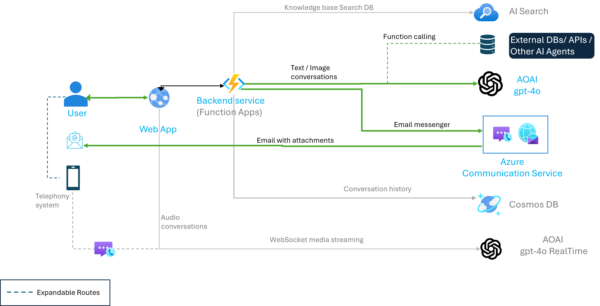

# echofill

# EchoFill

EchoFill is a demo project created to demonstrate the capability of multi-modality in Large Language Models (LLMs) as a useful tool in gathering structured information from audio conversations and filling out a form. It uses gpt4o-realtime-audio-preview model &amp; gpt-4o to interact with customer over text and voice calls and execute document automation. In this case, both models are sourced from Azure AI Foundry, though this demo will work with some minimal changes with models from OpenAI as well. 

## Solution Architecture

This project is designed to facilitate a comprehensive communication system that integrates various services and databases to provide seamless user interactions. The architecture diagram outlines the flow of data and interactions between different components, including user interfaces, backend services, AI search functionalities, and external databases.



The diagram above illustrates the flow of data and interactions between different components of the EchoFill system.

### User Interaction
- **User**: The starting point of the interaction. Users can interact with the system through a web application or telephony system.
- **WebApp**: The primary interface for users to interact with the backend services. It can handle text and audio conversations at this time, with support for image comprehension in plans.

### Backend Services
- **Backend Service**: This component processes requests from the WebApp. It handles:
  - Text conversations
  - Email communications (including attachments)
  - Processing of audio transcripts to extract structured information for form filling.

### Communication Channels
- **Azure Communication Service**: Manages communication history and real-time streaming through WebSocket media streaming.


### AI Integration
- **AOAI gpt-40 & AOAI gpt-40 RealTime**: These AI models are used for processing real-time data and providing intelligent responses.
  
### External Integrations (Future, not available now)
- **Knowledge Base Search DB**: A database used by the AI search functionality to retrieve relevant information.
- **External DBs/APIs/Other AI Agents**: Additional resources that can be accessed by the AI search functionality for more comprehensive results.
- **Cosmos DB**: Stores conversation history for future reference.


## Prerequisites

- Python 3.10
- Docker (for backend)
- Node.js and npm (for frontend)

## Getting Started

### Backend

1. Navigate to the `backend` directory:

    ```sh
    cd backend
    ```

2. Create a `.env.local` file with the necessary environment variables.
```
    gpt-4o_deployment_name=your_gpt4o_deployment_name
    gpt-4o_api_version=your_gpt4o_api_version
    gpt-4o_azure_endpoint=your_gpt4o_azure_endpoint
    gpt-4o_api_key=your_gpt4o_api_key
    email_conn_str=your_email_connection_string
    email_sender=your_email_sender_address
```
3. Build and run the Docker container:

    ```sh
    docker build -t echofill-backend .
    docker run -d -p 5000:5000 --env-file .env.local echofill-backend
    ```

4. The backend service should now be running on `http://localhost:5000`.

### Frontend

1. Navigate to the `frontend` directory:

    ```sh
    cd frontend
    ```

2. Install the dependencies:

    ```sh
    npm install
    ```

3. Create a `.env.local` file with the necessary environment variables.
The public URIs for the backend reflect the port on which the backend service is running, which is on localhost and port 5000. 
```
    NEXT_PUBLIC_GPT4Q_REALTIME_WEBSOCKET_URL=wss://{AZURE_OPENAI_ENDPOINT}.openai.azure.com/openai/realtime?api-version={API_VERSION}&deployment={GPT_4o_REALTIME_DEPLOYMENT_NAME}&api-key={API_KEY}
    NEXT_PUBLIC_APP_AOAI_URL=http://localhost:5000/get_chat_response
    NEXT_PUBLIC_APP_MAIL_URL=http://localhost:5000/form_send_email
    NEXT_PUBLIC_APP_AOAI_STRUCTURED_OUTPUT_URL=http://localhost:5000/get_structured_output
    NEXT_PUBLIC_APP_FORM_SUBMIT=http://localhost:5000/form_submit
```
4. Start the development server:

    ```sh
    npm run dev
    ```

5. The frontend service should now be running on `http://localhost:3000`.

## Usage

Once both the backend and frontend services are running, you can interact with EchoFill through the browser interface. 

### Demo scenario
You are a delivery agent looking to pick up a parcel from Contoso Logistics, to do this you need to fill out necessary forms to collect the delivery. You may be bi-lingual or multi-lingual, often switching between languages such as English, Chinese, Malay and / or Tamil. As you are driving, you may needs a handsfree option to fill out complicated forms for parcel delivery reciept. 

To use this, do the following steps:
1. Launch the frontend on the browser of your choice
2. Click the CargoMate logo at the bottom right hand side of the screen to launch the chat window
3. Start chatting with the app as with any other chat interface , but request that it give you a call. This should trigger the web app to initiate an audio session.
4. If the audio session is not triggered, click on the call button to self initiate the call.
5. Have a conversation with the audio agent, and provide the details required. In this scenario, we are demonstrating a Customer Service agent at Contoso Logistics, thus the kind of questions to answer will be related to Shipping consignments, collection date and identification requirements. 
6. At the end of the call, the audio agent will repeat all the information  to you, and you can modify any information that may be incorrectly captured. 
7. After the call ends, the browser chatbot will ask for your email address. Enter it manually here to recieve the confirmation email with the completed form. (Note: in real life scenario, private information such as email may be obtained from a backend CRM , after caller verification is completed)

## Feedback
Please note that this is a demo project, and any feedback regarding bugs or issues, please raise a Issue via this github project.